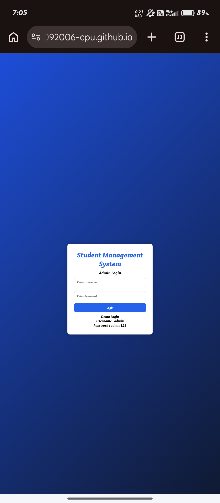
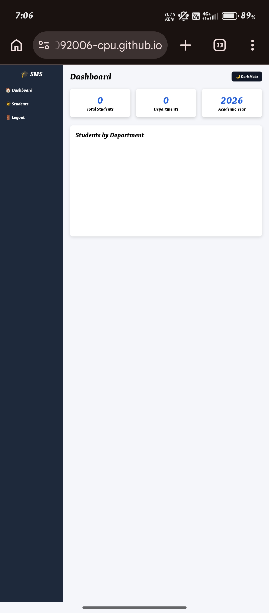
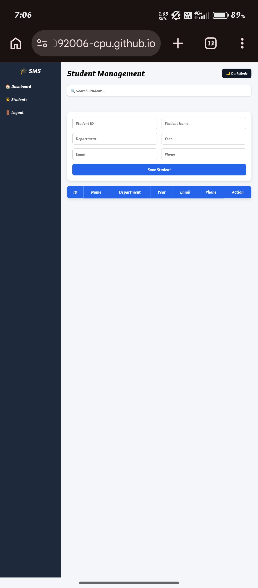

# 🎓 Student Management System
A simple and user-friendly web application designed to manage student information efficiently.

## 📌 About
Student Management System is a web-based application that helps users manage student records in an organized way.
The system provides an easy interface to add, view, update, and manage student details.

## ✨ Features
- 👨‍🎓 Add student details
- 📋 View student records
- ✏️ Edit student information
- 🗑️ Delete student records
- 📸 Student photo upload and preview
- 🔍 Search student records
- 📊 Dashboard with student statistics
- 🌙 Dark mode
- 💾 Data storage using Local Storage
- 📱 Responsive user interface

## 💻 Technologies Used
- **HTML5** – Website structure
- **CSS3** – Styling and responsive design
- **JavaScript** – Application functionality
- **Chart.js** – Dashboard charts
- **Local Storage** – Data storage
- **Git & GitHub** – Version control and project hosting

## 🚀 How to Use
1. Open the Student Management System.
2. Enter the required student details.
3. Add a student photo if required.
4. Click the **Save Student** button.
5. View the student records in the student list.
6. Use the edit and delete options to manage records.
7. Use the dashboard to view student statistics.

## 🎯 Project Objective
The main objective of this project is to provide a simple digital solution for managing student information and maintaining student records efficiently.

## 🌐 Live Demo
👉 [View Student Management System]:https://jeyabharathy30092006-cpu.github.io/Student-Management-System/

## 📸 Screenshots
### 🔐 Login Page

### 📊 Dashboard

### 👨‍🎓 Student Management

## 🔮 Future Enhancements
- 🔐 User authentication
- ☁️ Cloud database integration
- 📊 Advanced student analytics
- 📥 Export student records
- 📱 Mobile application
- 👥 Multiple user roles

## 👨‍💻 Author
**Jeya Bharathy**

Computer Science and Engineering Student

## ⭐ Support
If you find this project useful, please consider giving this repository on GitHub.

---

© 2026 Jeya Bharathy. All Rights Reserved.
